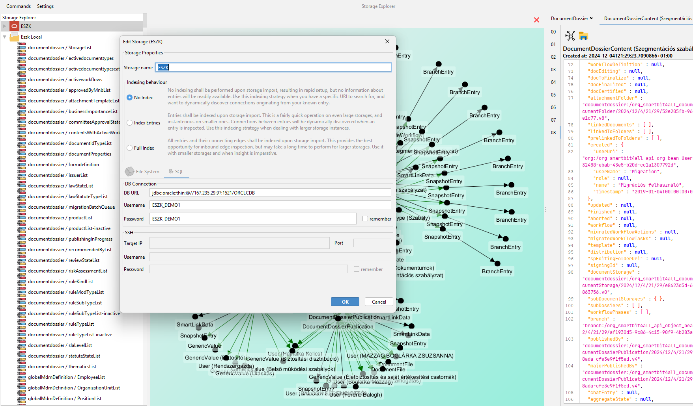
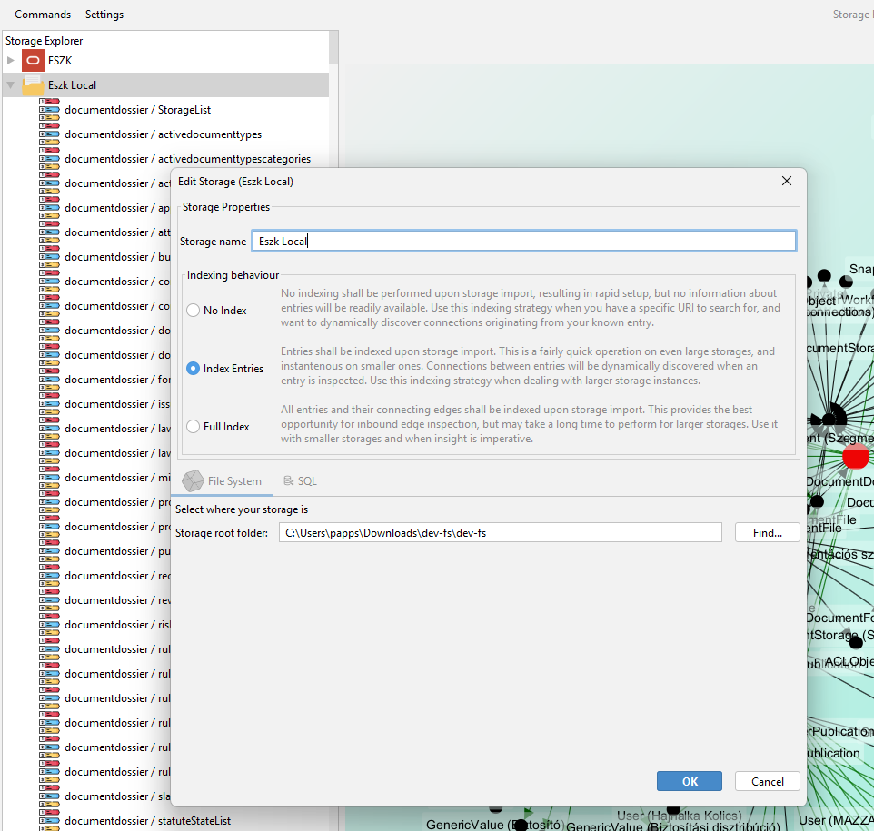
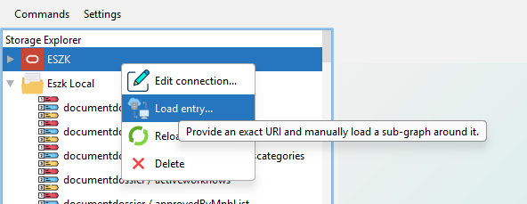
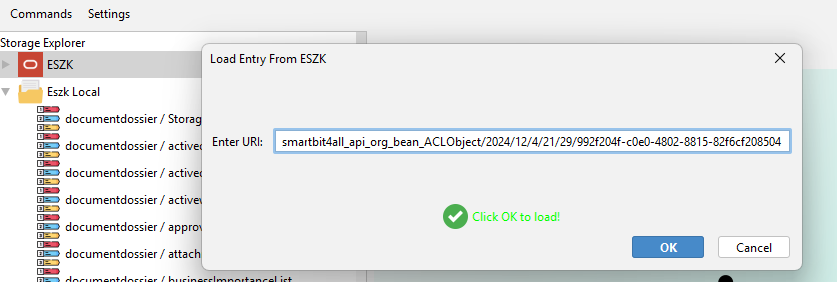
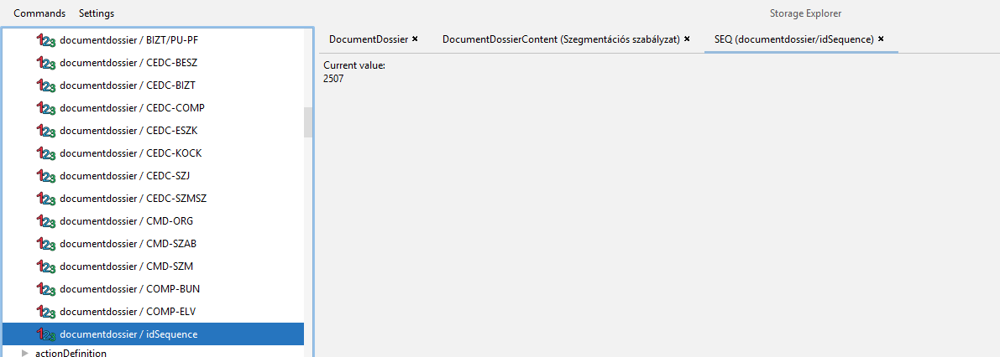
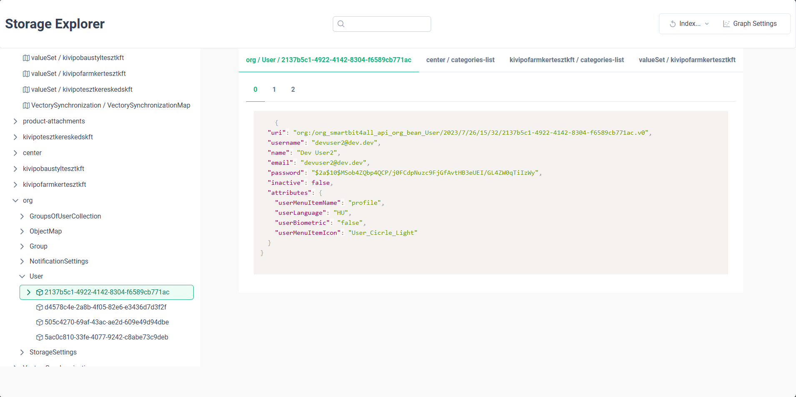
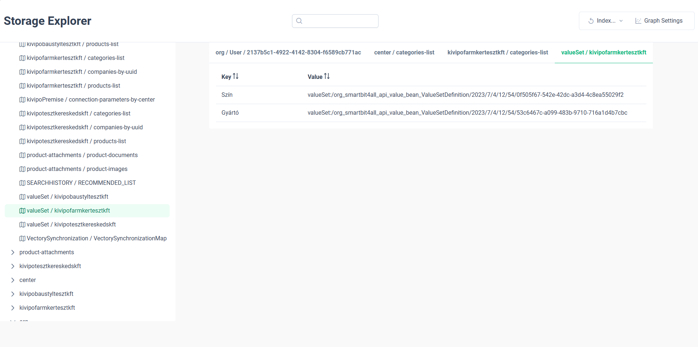
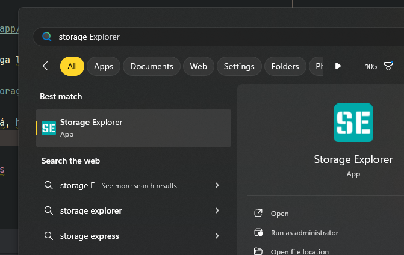

# Storage Explorer 0.3.0 fejlesztési kalandok

## Featurelista

- Teljes support SQL alapú storage-okra

  Természetesen minden támogatott DB típust egyedi ikonnal jelenítünk meg a fán...
- Testreszabható indexelési működés
    - **no index**: Nem történik objektumindexelés. Ez főleg nagy méretű, ill. SQL-alapú storage-ok
      esetén hasznos. Ha ezt választjuk, kézzel adható meg a betölteni kívánt URI, ami mentén a
      gráfbejárást elkezdhetjük.
    - **surface index**: Felindexeljük a létező objektumokat, de nem töltjük be őket. Ez nagy méretű
      storageoknál igen hasznos (ahol a teljes indexelés túl sok időbe kerülne)
    - **full index**: Ez a "legacy" működés: minden objektumot felindexelünk és betöltünk, hogy
      megállapítsuk milyen URI propertyket (referenciákat) tartalmaz. Nagy méretű storage esetén ez
      igen sokáig is eltarthat, de gráfvizualizáció során csak így tudunk befelé mutató éleket
      megtalálni. Így ha a storage elemzésének célja az, hogy pl. "találjuk meg, mik mutatnak az
      adott objektumra", akkor továbbra is ez a legjobb indexelési megoldás.

  Egy SQL alapú storage kapcsolatának testreszabása:

  

  Hagyományos, FS storage esetén:

  

  Az indexelési stratégiát, kapcsolati adatokat (és a storage nevét) betöltés után is szabadon meg
  lehet változtatni.

  No index esetén elérhető egy on-demand load action:

  

  ahol még formai validációt is végzünk, hogy nehogy valami elgépelt URI-t próbáljunk meg
  beload-olni:

  
- Mostantól támogatjuk a `StoredSequence`-eket és meg is jelenítjük őket:
  
- És még rengeteg bugfix, ill. óriási refaktorálások, melyek a fentieket lehetővé tették (ezekről
  bővebben kissé lentebb).

### Tágabb értelemben:

Elkészült egy Spring Boot Starter, melynek segítségével a Storage Explorert embedded módon, az
alkalmazásszerverről is lehet szolgáltatni REST API formájában. Nagyon idiomatikusan lehet
bekapcsolni, pl.:

```java

@SpringBootApplication
@EnableStorageExplorer
public class DemoApplication {

  public static void main(String[] args) {
    SpringApplication.run(DemoApplication.class, args);
  }

}
```

A fenti REST API-hoz pedig készülőfélben van egy Angular kliens. Két sneak peek, egy object
betekintő:


és egy Map betekintő:


## How to Run/Build, avagy Mi hol van?

A projekt repository-ja változatlan helyen
található: https://github.com/szabolcs-bazil-papp/storage-explorer

Ha valaki az asztali alkalmazást nem akarja maga lebuildelni, akkor jó hír, hogy a JPackage-nek hála
elérhető Windows installer
itt: https://github.com/szabolcs-bazil-papp/storage-explorer/releases/tag/v0.3.0

Ha feltelepítjük, még cuki ikon is társul hozzá, hogy egyediségével kitűnjön:


A Spring Boot Starter elérhető közvetlenül
itt: https://central.sonatype.com/artifact/com.aestallon.storageexplorer/storageexplorer-spring-boot-starter

Tetszőleges projektben történő bekapcsolásához az alkalmazás `build.gradle`-jében helyezzük el a
következőt:

```groovy
dependencies {
  implementation 'com.aestallon.storageexplorer:storageexplorer-spring-boot-starter:0.3.0'
}
```

..és valamely beimportált Spring configunkban (akár a `@SpringBootApplication`-ként annotált
osztályban) tegyük fel az `@EnableStorageExplorer` annotációt a fent illusztrált módon.

## Célkitűzések: StorageSQL és embedded működés

### StorageSQL és a nagy refaktor szükségessége

A téli szünethez közeledve sikerült képessé tenni az alkalmazást, hogy SQL alapú storage-okat
dolgozzon fel, mely művelet a `StorageIndex` interface-ének és implementációjának szétválasztását
jelentette. Rövidesen kiderült, hogy ugyan a feature technikailag működik, de gyakorlatilag
használhatatlan. Az eredeti (FS alapú) működés szerint ugyanis az index megkereste a felhasználó
által megadott könyvtár alatt fetrengő `.o` fájlokat, megfelelő típusú `StorageEntry` példányosított
belőle, majd ideiglenes betöltötte az összeset (hagyományos `objectApi.loadLatest(uri)`-t futtatva).

A fenti műveletet természetesen egy worker threadben indította, a betöltéseket pedig konkurrensen,
effective a commonPoolban végezte. Eredményképpen a tipikus, fejlesztéshez használt local storage-k
a másodperc törtrésze alatt kerültek indexelésre, míg nagyobb, több GB méretű storage-ok is kevesebb
mint fél perc alatt indexelésre kerültek.

Tettük mindezt a következő okokért:

- Szükséges legalább ismernünk, hogy milyen entry-k szerepelnek a storage-ban:
    - ez alapján rendereljük a fát
    - ezek közül az URI-k közül tud a felhasználó keresni és választani
    - és persze a kényelmi szempont:

      Ha van egy teljes, low-memory footprint, fix méretű indexünk (thus the name), akkor nem kell
      töprengeni, hogy egy URI-val való találkozás esetén mikor tekintsük azt validnak? A válasz
      egyszerű: ha az indexben szerepel, akkor valid, ha pedig nem, akkor nem.

      Így megengedhetjük a
      felhasználónak, hogy URI-ra keressen, de nem kell azzal foglalkoznunk, hogy mi történjen
      akkor, ha olyat kér, ami az indexben nem szerepel (nem tud olyat választani).

      Az a fájdalmas eset is megoldódik, hogy honnan döntsük el, hogy egy objectben lévő URI
      szintaxisú property valós referencia-e vagy sem. Illusztrációként itt egy részlet egy
      `DocumentGeneration` objektumból:
      ```json
      {
        "name" : "rvkCnt",
        "iteration" : false,
        "strategy" : null,
        "parentName" : "content",
        "path" : "/dossier/currentPublication/revokes",
        "fields" : [ 
        {
          "tag" : "rvkCnt:/currentCertifiedContent#data/id",
          "contextName" : "rvkCnt",
          "propertyPath" : "/currentCertifiedContent#data/id",
          "data" : null
        }, 
        {
          "tag" : "rvkCnt:/currentCertifiedContent#data/name",
          "contextName" : "rvkCnt",
          "propertyPath" : "/currentCertifiedContent#data/name",
          "data" : null
        } 
      ],
      "subContexts" : [ ]
      }
      ```
      Egyértelmű, hogy a két `"tag"` property szintaktikailag ugyan érvényes URI, de nem valós
      kifelé mutató él, ezért nincs értelme betölteni (vagy a gráfra felrajzolni) őket.
- Illendő betölteni minden objektumot, hogy az összes élt megtaláljuk
  Ez leginkább a gráfrajzoláshoz fontos, ha olyas dolgokra vagyunk kíváncsiak, melyet a
  featurelistában említettem.

Ez az út azonban SQL alapú storage esetén finoman szólva nem volt járható: viszonylag kis,
mesterségesen előállított storage DB esetén is várakozni kellett az indexelésre, demo-s p031 esetén
pedig a művelet több mint 5 percig tartott...

Újra kellett gondolni a megközelítést. Első körben elhagytam a teljes indexelést, és kizárólag
felszínit végeztem. Ez FS storage esetén azt jelentette, hogy megkerestük az `.o` fájlokat, és
elérési útjukból felépítettük a hozzájuk tartozó kanonikus `URI`-t. Ebből már elég információhoz jut
az ember, hogy a helyes `StorageEntry`-t példányosítson. SQL storage esetén pedig az alábbi (combos)
query-t adjuk ki:

```sql
SELECT URI
FROM OBJECT_ENTRY;
```

Ez természetesen jóval gyorsabb (hisz nem töltünk be minden egyes entry-t), de továbbra is percekben
mérhető művelet csillagállástól függően: az út az on-demand indexelésen keresztül vezet.

Utóbbiban megerősített egy rövid beszélgetésem Péterrel, melyben azt vetette fel, hogy mivel
általában a felhasználó valamely konkrét URI-t akar megvizsgálni, ezért jó lenne, ha az indexelést
nem kéne egyáltalán kivárni.

Ehhez azonban szükség volt pár dologra, melyek lavinaszerűen kijelölték, hogy merre menjek tovább:

**A `StorageIndex`-nek dinamikusan kell tudnia indexelési stratégiát váltani.** Erre született az
`IndexingStrategy` osztályhierarchia, ami gyakorlatilag tartalmazza az indexelés érdemi logikáját,
de mentes magának a _storage implementációjnak_ részleteitől.

**A UI-nak dinamikusan észre kell vennie, ha egy adott index bővül.** Ha tud a felhasználó on-demand
URI-t megadni és arra keresni, akkor annak természetesen a UI-on is meg kell jelennie. Ha úgy dönt,
hogy a sikeresen betöltött entry-re gráfot rajzoltat ki, akkor valamennyi kimenő él nem fog
szerepelni az indexben. Ezeket a háttérben dinamikusan fedezzük fel, minden egyes gráfrenderelő
iterációs lépés végén, és a UI-ra is vissza kell jutniuk (egyrészt a gráfra, másrészt a navigációs
fába).

Viszont, ha már tudunk on-demand loadolni, akkor ez akár egy REST API-ként is működhetne...

### Embedded mód

#### In principio...

Az egyik ismérve az alkalmazás kódjának, hogy noha egy szimpla Gradle projektből állt (egyetlen
build.gradle file-lal), a "backend" (üzleti logika) és a "frontend" (Swing komponensek) igen lazán
van kapcsolva, kizárólag Spring application eventeken keresztül. A tipikus user interaction a
következőképpen folyik:

1. a felhasználó végrehajt valamilyen akciót (pl. storage-ot indexel, vagy rákkattint egy entry-t
   jelképező tree node-ra)
2. A felelős Swing komponens ellő egy application eventet.
3. A backend event listenerje elkapja az eventet, és egy _külön, worker threaden_ megkezdi a munkát.
4. A munka végeztével (vagy meghiúsulásával) ellő egy application eventet, mely tartalmazza a munka
   eredményét, vagy a hibát.
5. A frontend event listenerje elkapja a válaszeventet, és az AWT EventQueue-be becommitolja a
   feldolgozását, a képernyő elkezd megváltozni.

Ennek betartásához természetesen fegyelemre van szükség (nehogy "backend"-re UI logika kerüljön),
mivel egyetlen projektben minden mindenhol elérhető.

Eredményképpen számos jó hozadéka van a fenti rendszernek, miszerint

- nem fordul elő, hogy "véletlenül" business logic fut az AWT EventDispatchThread-en, és megfagy az
  alkalmazás
- átlátható, hogy melyik komponens mivel foglalkozik, könnyebben lehet SOLID elveket követni
- az Event Listener osztály(ok)ban lokalizálódik az alkalmazás két felének kommunikációja: könnyű
  keresni, hogy egy adott akció hatására mi történik "hátul".
- Könnyű takarítani: ha a UI hivatkozna akár egy `ObjectNode`-ra is, és nem sikerülne eltakarítani,
  amikor a felhasználó kitörli a vonatkozó storage-t, elég rendes memory leak-et okoznánk: minden
  `ObjectNode` hivatkozik az `ObjectApi`-ra, ami hivatkozik legalább egy `ApplicationContextAware`
  bean-re, ami hivatkozik a vonatkozó `ApplicationContext`-re... tehát egy ilyen UI elem
  eltakarításának elmulasztásával meggátoljuk hogy a GC a teljes vonatkozó app contextet
  eltakarítsa! Minél kisebb a találkozási felszín backend és frontend között, annál megbízhatóbban
  méreteződik az alkalmazás memory footprintje.
- és a legfontosabb: a backend nem tud arról, hogy Swing klienst szolgál ki.

Az utolsó pont fényében egyértelmű volt, hogy ha az ember fiának van egy modulja, mely többféle
klienst is ki tud szolgálni, akkor **írni kell több klienst**. Egyébként a megoldás érdeme maximum
az esztétika volna.

#### ...erat verbum

Régóta szerettem volna Spring Boot Startert írni, és ez a projekt a tökéletes jelölt volt erre.
Ehhez természetesen át kellett alakítani a Gradle projekt szerkezetét, és alaposan átgondolni a
dependency-k deklarálásának helyét. Így alakult ki a jelenlegi modulszerkezet:

- common

  Minden olyasmit tartalmaz, amely semmitől sem függ: teljesen általános event objectek, ill.
  utility-k, mint pl. az elengedhetetlen `Pair<A, B>` (Why are Java developers so manly? If they
  want a tuple, they need to grow a pair...)
- core

  Itt szerepel minden lényegi üzleti logika. Rendelkezik Spring dependencyvel, ill. függ a
  platformtól is (értelemszerűen), de ezt csak `compileOnly`-ként teheti (Mavenben a provided
  scope), hisz a publikált starternek része.
- swing

  A Swing alkalmazás komponensei és controllerei. Ez a csomag nem függ közvetlenül a platformtól (és
  nem is használ semmit tranzitív módon)
- app-swing

  Belépési pont a Swing alkalmazás számára. Itt deklaráljuk a platformon való függést, ill. itt
  húzzuk be a szükséges Spring starterek, DB drivereket, Swing LAF (look-and-feel) dependenciát,
  stb.

  Egyébként ez a modul egyetlen osztályból és egyetlen `public static void main` függvényből áll...
- spring

  Egy wrapper service a `StorageIndex` köré, ill. OpenAPI generált kontroller a REST API
  kiszolgálására. `compileOnly` módban hivatkozik a `core` modulra.
- spring-boot-starter

  Itt kapott helyett az autokonfigurációs logika. `compileOnly` módban hivatkozik a `spring` modulra
  és a platformra. Build során a JAR-ba belefordítjuk az összes belső dependencyt (`common`, `core`
  és `spring` modulok). Platformot és másegyéb Spring okosságot nem csomagolunk.
- app-demo

  Egy demó Spring Boot alkalmazás, mellyel a startert lehet kipróbálni.
- app-angular

  Készülő kliens melyen a starter adta REST API-t fogyasztja el.

### Spring Boot Starter á la Bazil

A Broadcom ad egy teljesen jó guide-t, hogy miként kéne egy custom starternek kinéznie (elérhető
itt: https://docs.spring.io/spring-boot/reference/features/developing-auto-configuration.html),
melytől bizonyos mértékben eltértem. A javaslatuk körülbelül a következő:

Álljon az projekt két modulból:

- egy `autoconfigure` modulból, mely `compileOnly` módban hivatkozza az adott szoftverkomponenst,
  melynek a starterét készítjük. Itt implementáljuk a Spring beaneket és konfigokat, beleértve az
  autoconfigurationt.
- Egy `starter` modul, mely teljesen üres, kivéve a hírhedt `spring.factories` propertyfájlt. Ez
  rendesen hivatkozza az `autoconfigure` modult, ill. a kezelt szoftverkomponens(eke)t. Minden nem
  szigorúan szükséges dependency `compileOnly`.

Én összesen egy artifactot állítok elő, mely hozza magával a StorageExplorer:core összes szükséges
komponensét. A platform meglétére a felhasználó alkalmazásában impliciten támaszkodom - ez főszabály
szerint egy red flag, de esetünkben tökéletes (senki nem akar embedded Storage Explorert használni,
ha platformot sem használ).

Ami viszont az egésznek az értelmét adja, és nagyban követem a guideline-t az az opcionális
dependency-k kezelése. A Spring Boot autoconfiguration nagy ütőkártyája, hogy olyan kód is
szerepelhet benne, mely olyan osztályokra hivatkozik, amik a felhasználó classpath-ján nincsenek.
Teszi ezt úgy, hogy a szent `spring.factories` propfájlban lévő autokonfigurációs fájlokat ASM-mel
előemészti, és ha talál olyan olyan konfigot, ami `@ConditionalOnClass(...)` vagy
`@ConditionalOnBean(...)`, és a feltétel olyan osztályra hivatkozik, ami nem is létezik a
classpathon, akkor azt a konfigurációs osztályt be sem engedi a JVM-be!

Így pl. az alábbi, SQL Storage-t kiszolgáló konfiguráció:

```java

@Configuration(proxyBeanMethods = false)
@ConditionalOnClass({ StorageSQL.class, JdbcTemplate.class })
@ConditionalOnBean({ ObjectApi.class, CollectionApi.class, JdbcTemplate.class })
static class RelationalDatabaseConfiguration {

  @Bean
  @ConditionalOnMissingBean(StorageIndexProvider.class)
  public StorageIndexProvider relationalDatabaseStorageIndexProvider(
      ObjectApi objectApi,
      CollectionApi collectionApi,
      JdbcTemplate jdbcTemplate) {
    return new RelationalDatabaseStorageIndexProvider(objectApi, collectionApi, jdbcTemplate);
  }

  @Bean
  @ConditionalOnMissingBean(StorageIndexService.class)
  public StorageIndexService storageIndexService(StorageIndexProvider storageIndexProvider) {
    return new StorageIndexService(storageIndexProvider);
  }

  @Bean
  public ExplorerApiDelegate explorerApiDelegate(StorageIndexService storageIndexService) {
    return new ExplorerApiDelegateImpl(storageIndexService);
  }

  @Bean
  public ExplorerApiController explorerApiController(ExplorerApiDelegate explorerApiDelegate) {
    return new ExplorerApiController(explorerApiDelegate);
  }
}
```

egész egyszerűen kimarad a class loadingból, ha a felhasználó StorageFS-t futtat (és JdbcTemplate
nem is feltétlenül van a classpathon!!!).

Teszi ezt magabiztosan azért, mert az autoconfiguration mindig legutoljára, a felhasználó
alkalmazásában definiált konfigok és beanek létrehozása _után_ fut. Az ilyen különbségtétel nyilván
kikényszeríti, hogy autoconfig csak dependency-ből jöhet, mely a build-nek nem képezi részét (ezért
is készült belőle artifact). A `spring.factories` szent tehénre pedig értelemszerűen azért van
szükség, mert a Spring Boot nem akar minden egyes dependált JAR-t végigscannelni
autoconfiguration-ök után kutatva, ezeket ebben a fájlban kell expliciten megadni (különben egy
alkalmazásindítás évekig telne).

A fent említett sorrendiségi garancia teszi lehetővé, hogy a fenti kódrészletben
`@ConditionalOnMissingBean` annotációkat alkalmazzunk. Ez (és a hasonló conditional jellegű
annotációk) csak autoconfigurationban használhatóak érdemben, mert csak ilyenkor determinisztikus a
működésük (!!!). És az értelmük is világos: az artifact ad egy-egy singletont ezekből a beanekből,
de ha a felhasználónak testre kell szabnia a működést, akkor megadhat bárhol egy ilyen típusú
`@Bean`-t, és az autoconfiguration **mindenképp** a User beanjét fogja használni (hisz garantáltan
később fut).

## JDK 21

A fenti nagyívű átalakítások mesgyéjén felléptem 21-es JDK-ra. A projekt ugyan már eleve is azzal a
szemlélettel írodott, hogy olyan kód szülessen, mely idiomatikus 21+-os kóddá alakítható, de a
kibővült funkcionalitás egyéb okok miatt is szimpatikusabbá tette a váltást:

- no downstream dependency: magától értetődően a Storage Explorer-en nem dependál senki, ezért
  szabadon lehet verziót lépni.
- a starter up-to-date, támogatott Spring Boot verzióhoz készül
- A Swing alkalmazásból platform-specifikus, modularizált installer package készíthető, a Java17-től
  JDK részét képező JPackage révén
- Ha a starter 21-es Javát igényel, hátha több ember kap kedvet spontán verziót lépni a
  projektjével...

Alább mutatok pár példát 21-es language feature-kről, és mire használom őket.

### Event Object as Records

Mivel a Swing alkalmazás működése erősen event-driven, kismillió event típust "kellett" definiálni,
hisz a listenerek az event object típusát figyelik. Mivel az event objectekre igaz, hogy

- nincs megkötés a példányosításra (nem több, mint egy tetszőleges ctor hívás),
- transzparens value objectek, melyek identitása csak a memberjeiktől függ,
- immutable-ek, memberjeiket létrehozás után nem lehet és nem szabad reassign-olni,

tökéletesek arra, hogy `record`ként definiáljuk őket. Így egy tipikus event osztály ebből:

```java
public final class EntryAcquisitionFailed {
  private final StorageInstance storageInstance;
  private final URI uri;

  public EntryAcquisitionFailed(StorageInstance storageInstance, URI uri) {
    this.storageInstance = storageInstance;
    this.uri = uri;
  }

  public StorageInstance storageInstance() {
    return storageInstance;
  }

  public URI uri() {
    return uri;
  }

  @Override
  public boolean equals(Object o) {
    if (this == o)
      return true;
    if (!(o instanceof EntryAcquisitionFailed that))
      return false;
    return Objects.equals(this.storageInstance, that.storageInstance)
        && Objects.equals(this.uri, that.uri);
  }

  @Override
  public int hashCode() {
    return Objects.hash(storageInstance, uri);
  }

  @Override
  public String toString() {
    return "EntryAcquisitionFailed { storageInstance: "
        + storageInstance
        + ", uri: "
        + uri + " }";
  }
}
```

Az alábbi, ekvivalens record lesz:

```java
public record EntryAcquisitionFailed(StorageInstance storageInstance, URI uri) {}
```

### Sealed Class Hierarchies

A storage entry-jeinek modellezésére készült a `StorageEntry` interface, melyet minden, storage-ban
található cucc implementál. A cél eleve az volt, hogy zárt osztályhierarchiát alkosson
leszármazottaival, ezzel nagyban segítve a javac dolgát exhaustiveness bizonyításkor:

```java
public sealed interface StorageEntry permits
    ListEntry, MapEntry, ObjectEntry,
    SequenceEntry, ScopedListEntry, ScopedMapEntry,
    ScopedObjectEntry { /* ... */}
```

Egy kicsit kevésbé terjedelmes példa még a scope-pal rendelkező entry-k saját, mini hierarchiája:

```java
public sealed interface ScopedEntry permits ScopedListEntry, ScopedMapEntry, ScopedObjectEntry {

  URI uri();

  URI scope();

}
```

Utóbbi pl. lehetővé teszi, hogy egy switch expression keretében pattern matchinggel kezeljük egy
StorageEntry tree node esetleges gyerekeit:

```java
public StorageObjectTreeNode(ObjectEntry objectEntry) {
  super(objectEntry, true);

  objectEntry.scopedEntries().forEach(it -> add(switch (it) { // switch expression, not statement!
    case ScopedMapEntry m -> new StorageMapTreeNode(m);       // evaluates to the matched pattern
    case ScopedObjectEntry o -> new StorageObjectTreeNode(o);
    case ScopedListEntry l -> new StorageListTreeNode(l);     // no need for 'default' branch, the
  }));                                                        // compiler knows we exhausted every
  supportsChildren = !objectEntry.scopedEntries().isEmpty();  // possibility!
}
```

### Switch Expressions & Pattern Matching

Még egy tipikus példa a pattern matching szépségére. Vegyük az alábbi, korábbi helper függvényt,
mely visszaadja a kérdéses `StorageEntry` típusnevét.

```java
static String typeNameOf(StorageEntry storageEntry) {
  if (storageEntry == null) {
    return StringConstant.NULL.toUpperCase();
  }

  if (storageEntry instanceof ListEntry) {
    return "List";
  }

  if (storageEntry instanceof MapEntry) {
    return "Map";
  }

  if (storageEntry instanceof ObjectEntry) {
    return ((ObjectEntry) storageEntry).typeName();
  }

  return "Unknown type";
}
```

Gyönyörűséges, tipikus Java kód: át kell esnünk egy null-checken (hátha idetéved valami null),
majd "kézzel" pattern matchelünk, mégis mivel van dolgunk. Mivel nem tudjunk elmagyarázni a
compilernek, hogy igazából nincs "else" ág, defaultból visszaadunk egy `"Unknown type"` választ (ami
ugyebár sohse fordulhat elő).

Nosza, írjuk át pattern matching switch expressionné, hisz a `StorageEntry` egy sealed hierarchy,
nem is kell default branch!

```java
static String typeNameOf(StorageEntry storageEntry) {
  return switch (storageEntry) {                    // <-- compilation error!
    case null -> StringConstant.NULL.toUpperCase();
    case ListEntry l -> "List";
    case MapEntry m -> "Map";
    case ObjectEntry o -> o.typeName();
  };
}
```

Egyetlen return statementé zsugorodott a metódus, még a `null` esetet is tudjuk patternként
kezelni (a legacy switch statementben ha a switch változó `null`, akkor a JVM `NullPointerException`
-nel elszáll, ezért aggresszívan null-checkkelni kell minden switch statement előtt...).

Viszont kaptunk egy compilation errort! A javac szerint:
`'switch' expression does not cover all possible input values`

Ez kínos... Feltekintve látszik, hogy ezen helper függvény még azelőtt írodott, hogy
`StoredSequence`-eket kezeltünk volna, és ezért a döntési fából egyszerűen hiányzik! Pótoljuk be és
lám:

```java
static String typeNameOf(StorageEntry storageEntry) {
  return switch (storageEntry) {
    case null -> StringConstant.NULL.toUpperCase();
    case ListEntry l -> "List";
    case MapEntry m -> "Map";
    case SequenceEntry s -> "Sequence";
    case ObjectEntry o -> o.typeName();
  };
}
```

Minden a helyén, és még unreachable default ágat sem kellett írni!

## Angular

A kliens még igen kezdetleges állapotban van, csak azért említenék róla szót, mert a célkitűzés az,
hogy egy értékelhető példa legyen arra, hogy mikor és hogyan érdemes `Signal`-okat és `Subject`-eket
használni. Ennek morzsái már a mostani állapotban is fellelhetőek, de természetesen még elég ad hoc
jelleggel. A stack jelenleg:

- Angular 19, minden komponens standalone
- PrismJS az entry betekintő syntax highlightinghoz
- PrimeNg component library
- D3 gráfvizualizációhoz (coming soon)

## Egy fájdalmas bug

SQL Storage-okkal való kísérletezés során derült ki, hogy néha előjön egy rejtélyes bug: Az SQL-es
storage-k néha megbolondulnak és minden objectApi.load elbukik (
`"The query execution for the given QueryInput finished with no result!"`). Ez igen nyugtalanító
volt, főleg, hogy nem értettem, mi okozhatja.

A megtalálást nehezítette, hogy a Storage Explorer egy olyan platform branchet használ, melyen az
ütemezett storage interakciók (ApplicationSetup, ApplicationRuntime és InvocationRegistry API-k)
opcionálissá vannak téve és ki vannak kapcsolva. Erre a "szemetelés" elkerülése végett volt szükség,
amennyiben nem lokális storage-hoz kapcsolódik az alkalmazás (és a Windows installer is így készül).

Ha a fenti három API ütemezetten fut, korábban kiderült volna a jelenség, but alas...

Hosszas, és fájdalmas kutakodás után sikerült reprodukálnom a hibát: Egy SQL storage az Explorerben
akkor és csak akkor működik, ha a beimportált storage-ok közül az utolsó helyet foglalja el a
felsorolásban (!!).

Innen már viszonylag egyszerű volt beazonosítani a bűnöst, íme, ő az:

```java

@Service
public class CrudApis implements InitializingBean {

  private static CrudApis instance;

  private CrudApi crudApi;

  /**
   * To avoid on demand instantiation.
   */
  public CrudApis(CrudApi crudApi) {
    this.crudApi = crudApi;
  }

  @Override
  public void afterPropertiesSet() throws Exception {
    instance = this;
  }

  public static final CrudApi getCrudApi() {
    if (instance == null) {
      throw new IllegalStateException(
          "There is no QueryApi implementation registered in the Spring Context!");
    }
    return instance.crudApi;
  }

}
```

Történik ugyanis, hogy minden egyes app context indításkor megfut ez a szerencsétlen, és felülírja a
static `instance` membert. Így természetesen elveszítjük az adott storageokhoz tartozó helyes
`CrudApis` példányt, így a `CrudApi` példányt, és a gondosan felkonfigurált `CrudExecutionApi`
példányt. FS Storage-k természetesen jól működnek ezzel a malőrrel is, de az SQL Storage
connectionök holtan koppannak a talajra.

Tettem egy kísérletet arra, hogy a `StorageInstance`-okat külön platform threadekbe szegregáljam,
amelyekben egy custom `ClassLoader`-t implementáltam, ami mindent az app classloaderhez delegál,
***kivéve a CrudApis***-t. De sajnos a `CrudApis` egy `@Service` amit a Spring szkenneléssel talál
meg (már önmagában az csoda, hogy hogyan!), és lenyúl a híres hírhedt `sun.misc.Unsafe`-hez
inicializálás céljából, kikerülve az app contexthez expliciten beállított `ClassLoader`-t (ez
hozzátenném önmagában is felháborító). Na bumm...

Ha idáig elolvastad, és van ötleted, hogy hogyan tudnám ezt a global konstans okozta galibát
megoldani anélkül, hogy egy külön forkot átírjam a teljes `platform:sql` modult, nagy szeretettel
várom a javaslatokat!

## Merre tovább?

Rengeteg minden van még a tarsolyban, amerre a Storage Explorer növekedhet. A teljesség igénye
nélkül:

- a teljes értékű Angular kliens befejezése
- entry szerkesztés/felülírás lehetővé tétele (editor, difftool, és auditing info visszaírása a
  storage-ba)
- a gráfvizualizáció már szebb, mint 0.2.0-ben volt, de még van hova fejlődni
    - extenzív gráfkonfiguráció (milyen típusok hogyan legyenek megjelenítve, milyen típusok ne
      szerepeljenek a vizualizációban)
- Spring Boot Starter konfigurációs dokumentációja (mily jó lenne, ha mindenfélét property-ből is
  lehetne állítani, amire az IDE-k autocomplete-t és dokumentációt mutatnak)
- Spring Boot Starter stateful indexelési lehetőséggel kibővítése
- és rengeteg "belső szépség" a Swing appban
    - egységes hibaüzenetkezelés minden üzleti logikában az Errors as Value paradigmát követve.
    - egységes background work pool kezelés taskQueue-val (nagyon hiányzik az abort operation!)

Remélem jó szórakozás volt ez a szösszenet, folyt köv!