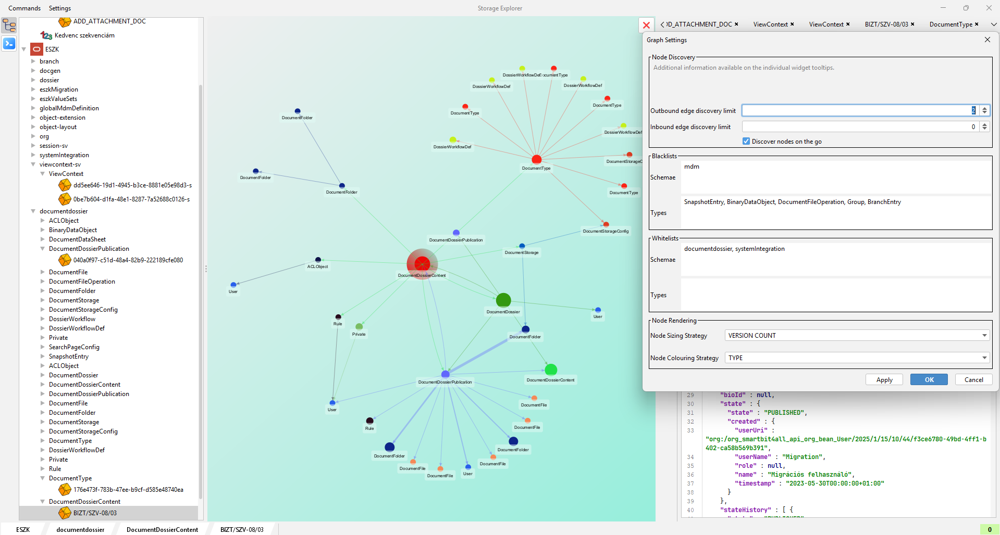
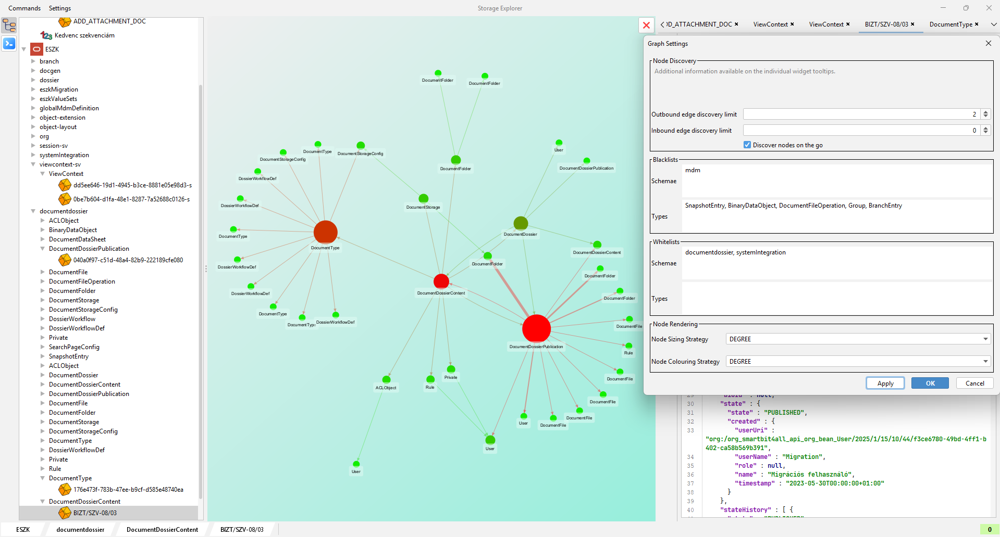
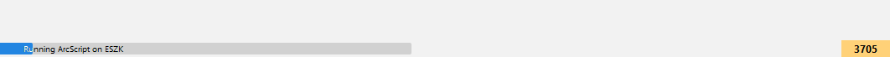
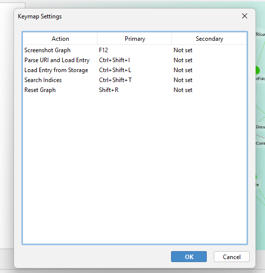
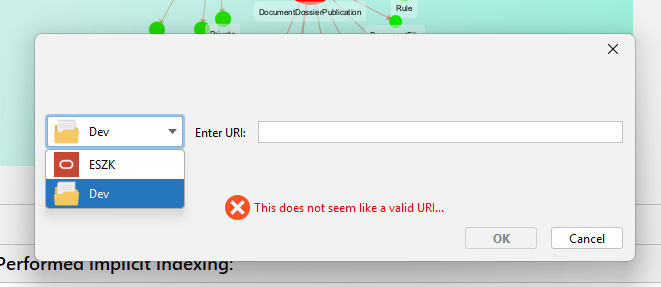
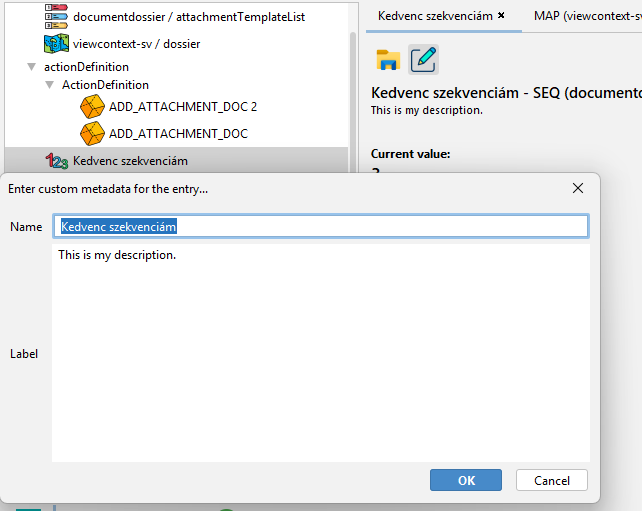
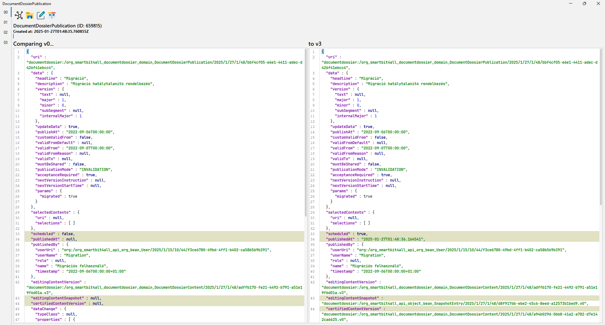
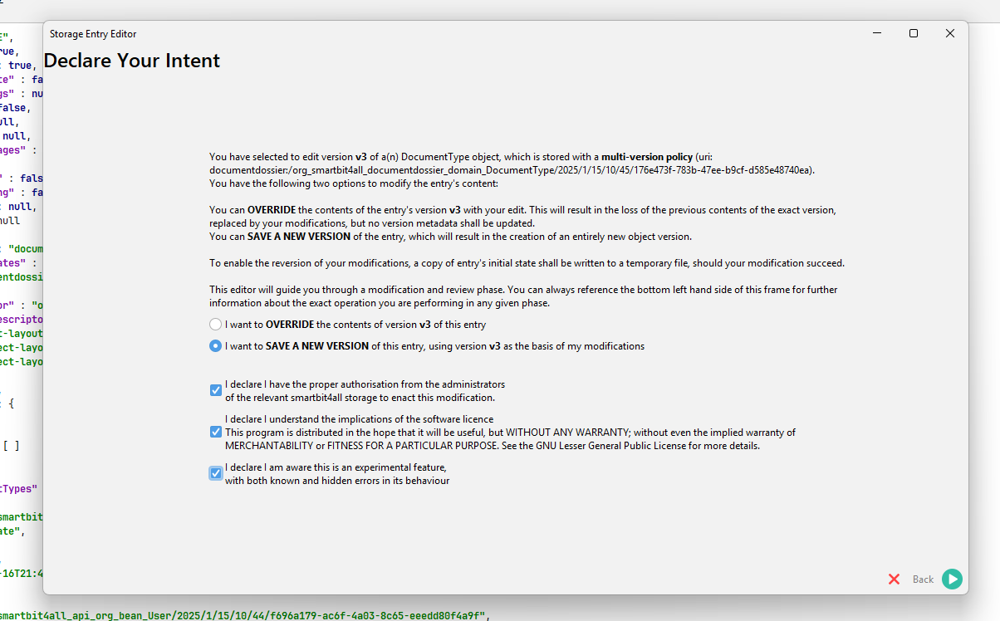
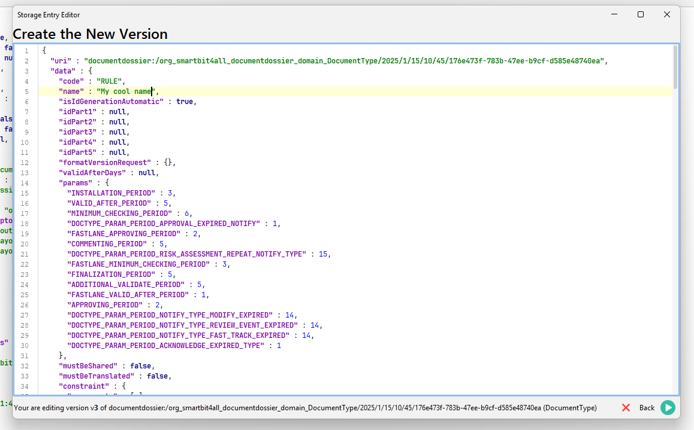
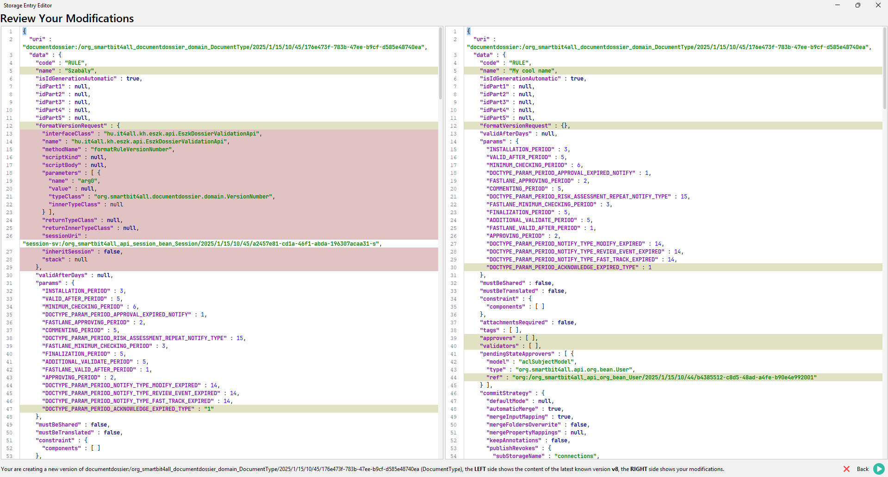

# Storage Explorer 0.4.0 fejlesztési kalandok

Utoljára január elsején írtam ilyen szösszenetet, amit az akkor még vadiúj `StorageSQL`
támogatásának implementálása, és az embedded módon való működést megalapozó Spring Boot starter
megírása inspirált. Ezt követően még folyt egy bő hónapnyi fejlesztés, melyről szóban ugyan
beszámoltam (itt is köszönöm mindenki kedves türelmét!), de a hallgatóságon - és a nagyon kitartó
érdeklődőkön - túl máshoz nemigen jutott el. Hátha ezen tanulságok hasznosak, vagy ha azok nem is,
de legalább érdekesek lesznek!

Ezt követően, legfőképp az idő hiánya miatt, egy hosszabb inaktív periódus következett. Kizárólag
hibajavítások és optimalizációk készültek, szigorúan azon területekre fókuszálva, melyekre nekem,
vagy a p031 tábor más tagjainak éppen szüksége volt.

Az elmúlt hetekben Attis elkészült a `StorageSQL` tömörítést is alkalmaz(hat)ó változatával, mely új
lökést adott, hogy letegyem a fenekem, és újra nekiveselkedjek az érdemi fejlesztésnek - kár lett
volna, ha a séma- és objektumtárolás-formátum változásával használhatatlanná válik ez a projekt. Ez
természetesen nem csak az elfogult szentimentalitás mondatja velem: a hibás működésének feltárásának
egyik leghatékonyabb módja az adatok integritásának ellenőrzése, mely `StorageSQL` alapon kissé
nehézkes (főleg, ha az adatbázis puszta megközelítése sem triviális); tömörített `OBJECT_CONTENT`-ek
esetén pedig főleg nem lelkesítő feladat.

Alább találtok pár gondolatot a tömörített `StorageSQL` támogatásának kalandjairól, egy
már rég belengetett feature ötlet (rekordfelülírás/módosítás) elméleti kihívásairól, illetve egy-két
szót az `ArcScript` "nyelvről" - egy Groovy alapú query DSL-ről, mely a StorageExplorerrel
bundle-ölve érhető el.

## Featurelista

- Teljes támogatás mind tömörítést alkalmazó, és azt nem alkalmazó `StorageSQL` kezelésére - a
  működési mód futási időben kerül megállapításra, így konfigurációra nincs szükség.
- Jóval stabilabb és gyorsabb indexelés és `ArcScript` végrehajtás a januári állapothoz képest.
- Testreszabható gráfvizualizáció (fehér- és feketelisták, csomópontméretezés és színezési
  beállítások)

  

  *csomópontok objektumtípus szerint színezve, verziószám szerint méretezve*

  

  *csomópontok degree szerint színezve és méretezve*
- Egy csokor "quality of life" update:
    - A kliens kijelzi, hogy hány rekord várakozik betöltésre indexelés és lekérdezés végrehajtás
      alatt.

      
    - A megnyitott betekintőket felírjuk a kéménybe korommal, és alkalmazásinduláskor újranyitjuk
      őket.
    - A támogatott billentyűkombinációkat meg lehet tekinteni, ha esetleg nem tudjuk álmunkból
      ébredve is felsorolni őket:

      
    - Az objektumbetöltés dialógusban választható, hogy melyik storage-ból szeretnénk tölteni, és a
      legutolsót meg is jegyzi az alkalmazás. A dialógust már billentyűkombóval is elő lehet hívni:

      
    - Az egyes rekordoknak egyedi nevet és leírást lehet adni, melyet szinte minden GUI elemen
      használunk - hogy később meg lehessen ismerni, hogy a 82 nyitott `ProcessInstanceState` közül
      melyik melyik:

      
    - Difftool, amivel össze lehet hasonlítani egyazon objektum különböző verzióit:

      
    - Ha olyan hatalmas objektumot szeretnénk megtekinteni, amit az egyébként kiváló
      `RSyntaxTextArea` már nem bír, akkor automatikusan hagyományos `JTextArea`-ra vált az
      alkalmazás az adott rekordnál. Itt nincs sajnos keresés, és syntax highlighting egyelőre, de
      legalább az FPS mutató a természetes számok halmazán marad :)
    - `StorageSQL`-ben tárolt rekordok esetén kijelezzük az `OBJECT_ENTRY.ID` értéket, mert néha
      hasznos tud lenni...

## Compression Enabled StorageSQL

Mivel a Storage Explorer by design egyszerre több storage-t tud kezelni, alapvetés volt, hogy a
tömörítés támogatása úgy valósuljon meg, hogy ne veszítsük el annak képességét, hogy még korábbi, a
tömörítést nem ismerő adatbázisokat is továbbra is tudjunk kezelni. Ennek praktikus oka pusztán az
volt, hogy az átállás során különböző környezetek még különböző platformverziókat - és különböző
adatbázissémákat használnak. Kár lett volna összebuildelni egy release-t, ami demó környezetben
ugyan működik, de éles adatbázison "még" nem.

Ennek technikai megvalósítása nem túlságosan bonyolult: amikor egy relációs adatbázison futó
`StorageIndex` először megkísérel olvasni az adatbázisból, megkérdezzük, hogy van-e már tömörítést
jelölő oszlopunk:

```oraclesqlplus
SELECT COLUMN_NAME, DATA_TYPE
FROM ALL_TAB_COLUMNS
WHERE TABLE_NAME = 'OBJECT_VERSION'
  AND COLUMN_NAME = 'OBJECT_CONTENT_COMPRESS_TYPE'
```

és az eredmény alapján választunk SQL query template-eket a későbbiekben. Egy érdekes mellékszála az
ilyetén való működésnek az, hogy a Storage Explorernek mellőznie kell az `ObjectApi`/`CollectionApi`
használatát minden `load` jellegű műveletnél, mert az `EntityDefinition` mismatch-et nem lehet
elmagyarázni szegény `StorageSQL`-nek.

Ez nem jelentett _túl nagy változtatást_, mert a legtöbb betöltésnél már eleve nem használta a
program a fenti API-kat. Ennek oka, hogy a legtöbb `load` jellegű művelet `INSERT` side effect-el
jár, a Storage Explorer-nek pedig azt kell mindenkor feltételeznie, hogy nincs írási joga a vizsgált
sémához (ez bizonyos környezetekben így is van, ez tehát nem egy pusztán elméleti probléma). Ha
lenne is írási jog, az sem lenne túl szerencsés, hisz eredményképpen a vizsgált adatbázisba "
piszkítana" az Explorer használója, ami környezettől függően nem biztos, hogy megengedhető.

Eredményképpen az egyetlen változtatás, melyet meg kellett ejteni, a verziózott `URI`-val történi
`objectApi.load(URI)` kiváltása volt. A működés így sem tökéletes sajnos: egyelőre nincs support a
`CollectionApi` által kezelt listák és map-ek betöltésére a "legacy" `StorageSQL` alatt futó
alkalmazások esetén.

Noha az átállási időszak meglehetősen rövid, a fenti hiányosságot is pótolni fogom a jövőben:
ugyanis a fenti API-któl való függetlenedés lehetővé teszi annak a gyakorlati akadálynak
megkerülését, hogy a `Crud.*` statikus függvények miatt egyszerre csak egy, `StorageSQL`-t használó
storage-t tud az Explorer kezelni. Erről az platform-kuriózumról az előző irományomban már
részletesebben írtam, így itt most nem teszem. Nem tudtam meggyőzni magam, hogy egy forkon történő
refaktorálása megérné-e a belefektetett energiát, főleg hogy az Exploreren kívül más "
kedvezményezettje" nem lenne - így marad megoldásnak mindenki kedvenc műfaja, a körbeprogramozás.

## Rekordfelülírás - elméletben

Már az előző beszámolóban is - aspirációként - említett képesség lenne a _data manipulation_, a
teljesség igénye nélkül:

- konkrét verzió felülírása
- új verzió mentése, valamely korábbi verziót felhasználva kiindulási alapnak
- a fejverziószám felülírása, s ezzel egy vagy több objektumverzió elvetése

Ez a képesség továbbra is szép aspiráció, mely adott esetben számos `SetupApi` szorgos megírását is
ki tudná váltani.

Jelenlegi állapotában a Storage Explorer nem képes még erre, de már szerepel a contract-ként
szolgáló interface. A közelmúltban addig jutottam el, hogy sorba vettem a módosítás körüli technikai
problémákat, melyek a következők:

### Lehet-e bízni az `ObjectDefinition`-ökben?

Amennyiben a Storage Explorer embedded módon "fut", akkor igen: az index mögött dolgozó
`ObjectDefinitionApi`-nak teljes rálátása van a manage-elt sémákhoz tartozó _versioning policy_-k
mibenlétére, ill. képben van a tárolt típusok `ObjectReferenceConfig`-jait illetően. Feltéve, hogy a
felhasználó magát az objektumtartalmat szerkeszti, _single version_ object-ek felülírásához és
_multi version_ object-ek új verziójának mentéséhez nincs másra szükség, mint delegálni egy jól
irányzott `ObjectNode.setValuesWithReference(Map<String, Object>)` hívásnak (kis külön figyelemmel a
`CollectionApi` által kezelt típusokra).

A verziófelülírást azonban nem lehet ilyen könnyen megúszni: Ilyenkor szerkeszteni
kell a vonatkozó verziófájlt (megőrizve annak integritását), vagy egy jól célzott `UPDATE`-t
végrehajtani a megfelelő `OBJECT_VERSION` rekordon. Utóbbi nagyságrendekkel egyszerűbben
kivitelezhető, anélkül, hogy túl sok, egyébként enkapszulált működést megsejtsen az implementáció;
`StorageFS`-en azonban jóval komplikáltabbnak tűnik a helyzet. Véleményem, hogy ennek a funkciónak -
valahol, kellően őrzött helyen - a platformban van a helye, és így összekapcsolható bizonyos cache
invalidation-ökkel is.

Amennyiben azonban a Storage Explorer standalone alkalmazásként működik, akkor sajnos sem a
_versioning policy_-k, sem a runtime `ObjectReferenceConfig`-ok nem állnak rendelkezésre, így fel
kell tűrnie az embernek az ingujjat. A mentést, érdekes módon, egy jól irányzott
`ObjectNode.setValues(Map<String, Object>)` technikailag megoldja (hisz `ObjectReferenceConfig`-ok
hiányában az `objectAsMap` a teljes hiteles reprezentációja a `node`-nak), de a verziófelülírás
továbbra is gondolkodást igényel.

### WIP

Ha valakinek van javaslata, hogy milyen formában célszerű megközelíteni a fenti kérdéskört, szívesen
várom egy kávéra :), jelenlegi formájában ez a funkciókör egyelőre egy kialakulófélben lévő
teszt-prototípus és unit test sorozat formájában kezd alakot ölteni csupán.

Készült azonban egy sorozat editor mock-up, melyet a standalone alkalmazásban meg lehet tekinteni.
Részei:

1. Egy nyilatkozattevő oldal, ahol a User kiválasztja, hogy új verziót akar menteni, vagy
   verziófelülírást akar végrehajtani:

   
2. Egy szerkesztőfelület, ahol magát az objektumtartalmat lehet átírkálni:

   
3. És egy diff nézet, ahol a módosításokat lehet review-zni:
   

Természetesen a végén valódi mentés nem történik. A preview elérhető, ha az alkalmazást
`--enable-editor` vagy `-e` flag-gel indítjátok, bármelyik betekintő felületen.

## ArcScript

## Merre tovább?

- MODIF
- CLI